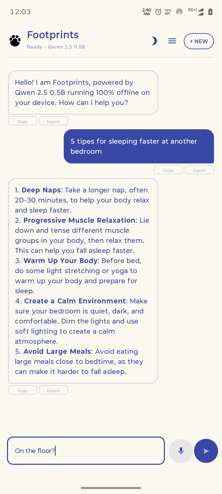

<div align="center">


<h1>Footprints</h1>

> **Your private AI companion. 100% on-device. 100% offline. Zero compromises.**

[](https://developer.android.com/about/versions/11)
[](https://huggingface.co/Qwen/Qwen2.5-0.5B-Instruct-GGUF)
[](https://github.com/ggml-org/llama.cpp)
[](LICENSE)
[](https://github.com/rajumark/Footprints/actions/workflows/release.yml)

</div>

---

## ✨ Why Footprints?

Every step you take in the digital world leaves a **footprint**. Your data, your conversations, your thoughts — they shouldn't belong to a server in someone else's data center.

**Footprints** is a chat app that runs entirely on your Android device. No cloud. No internet. No data collection. Just you and a powerful AI — Qwen 2.5 0.5B — living in your pocket.

---

## 🧠 What's Under the Hood

```
┌─────────────────────────────────────────────────┐
│                   Footprints                      │
├─────────────────────────────────────────────────┤
│  ┌──────────────┐    ┌───────────────────────┐   │
│  │  Jetpack      │    │   Qwen 2.5 0.5B      │   │
│  │  Compose UI   │◄──►│   Instruct (GGUF)    │   │
│  │  (Material 3) │    │   ┌───────────────┐  │   │
│  └──────────────┘    │   │  llama.cpp     │  │   │
│                      │   │  (C++ Engine)  │  │   │
│                      │   └───────────────┘  │   │
│                      └───────────────────────┘   │
└─────────────────────────────────────────────────┘
          ▲                            ▲
          │                            │
          ▼                            ▼
   Your Phone Screen               Your CPU
```

- **🤖 Qwen 2.5 0.5B** — A 500M-parameter instruction-tuned model from Alibaba Cloud, quantized to Q4_K_M for efficient on-device inference (~469MB)
- **⚡ llama.cpp** — The legendary C++ inference engine that brings LLMs to everyday hardware. No GPU required.
- **🎨 Material 3** — Modern Compose UI with dynamic theming, chat bubbles, and smooth animations
- **📦 Bundled model** — The GGUF file ships inside the APK. First launch copies it to app storage.

---

## 📱 App Preview

<div align="center">
  
  <br/><br/>
  <video src="screenshots_video/demovideo.mp4" controls width="280" poster="screenshots_video/screenshot1.png">
    Your browser does not support the video tag.
  </video>
  <br/><br/>
</div>

---

## 📦 Installation

| Method | Command |
|--------|---------|
| **Download APK** | Grab latest from [Releases](https://github.com/rajumark/Footprints/releases) |
| **Install via ADB** | `adb install app-debug.apk` |
| **Build from source** | `./gradlew assembleDebug` |

> **Requirements:** Android 11+ (API 30), ~1GB free storage, 500MB+ RAM

---

## 🛠️ Development

```bash
# Clone with LFS (model file is LFS-tracked)
git clone https://github.com/rajumark/Footprints.git
cd Footprints
git lfs pull

# Build
./gradlew assembleDebug

# Install on connected device
adb install app/build/outputs/apk/debug/app-debug.apk
```

### 📁 Project Structure

```
app/
├── src/main/
│   ├── assets/
│   │   └── qwen2.5-0.5b-instruct-q4_k_m.gguf  ← The model (469MB, LFS)
│   ├── java/com/example/footprints/
│   │   ├── MainActivity.kt                      ← Entry point
│   │   ├── llm/
│   │   │   └── LlmEngine.kt                     ← Inference wrapper
│   │   ├── ui/chat/
│   │   │   ├── ChatScreen.kt                    ← Compose UI
│   │   │   ├── ChatViewModel.kt                 ← State management
│   │   │   └── ChatMessage.kt                   ← Data model
│   │   └── theme/                               ← Material 3 theme
│   └── AndroidManifest.xml
├── build.gradle.kts
└── ...
```

---

## 🔄 CI/CD

Every push to `main` with `#go` in the commit message triggers GitHub Actions to:

1. ✅ Checkout with LFS
2. ✅ Build the debug APK
3. ✅ Create a **GitHub Release** with version from `build.gradle.kts`
4. ✅ Upload the APK as a release artifact

[](https://github.com/rajumark/Footprints/actions/workflows/release.yml)

---

## 📊 Sizing

| Component | Size |
|-----------|------|
| Qwen 2.5 0.5B (Q4_K_M) | 469 MB |
| App code + native libs | ~37 MB |
| **Total APK** | **~506 MB** |

---

## 🗺️ Roadmap

- [x] Basic chat with local Qwen 2.5 0.5B
- [x] 100% offline inference
- [x] CI/CD with auto-release
- [x] Chat history persistence (JSON)
- [x] Token streaming
- [x] System prompt customization
- [x] Export conversation
- [x] Dark/light theme toggle
- [x] Markdown rendering
- [x] Voice input
- [x] Chat conversation management

---

## 📜 License

MIT — Use it, fork it, ship it. See [LICENSE](LICENSE).

---

<div align="center">

**Built with ❤️ for the Edge AI era**  
*Your data stays where it belongs — in your hands.*

[](https://github.com/rajumark/Footprints)

</div>
